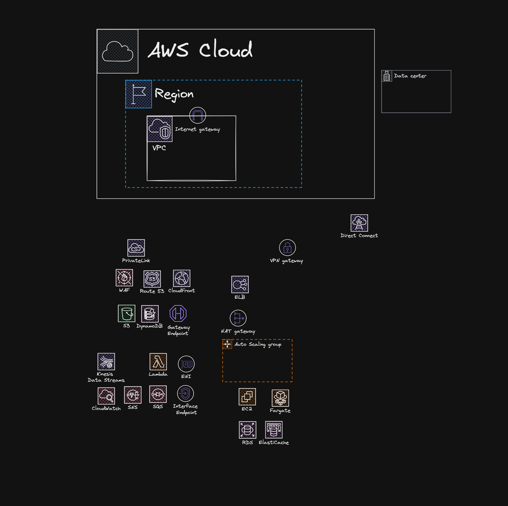

# 🚀 AWS 기반 고가용성 Full-Stack 인프라 아키텍처 (IaC)

본 프로젝트는 Terraform을 사용하여 실무 수준의 AWS 클라우드 아키텍처를 코드로 관리(IaC)하고,
React 프론트엔드와 Node.js 백엔드 서비스를 배포하는 End-to-End 데모 프로젝트입니다.
단순한 인프라 구성을 넘어 보안, 확장성, 가용성을 고려한 현대적인 아키텍처를 지향합니다.



## 🏗 Key Architecture Highlights

### 1. 고가용성 및 확장성 (High Availability & Scalability)
- **Multi-AZ 아키텍처:** 2~3개의 가용 영역(AZ)에 걸쳐 퍼블릭, 프라이빗, 데이터베이스 서브넷을 논리적으로 분리하여 구성했습니다.
- **Auto Scaling Group (ASG):** 트래픽 부하 및 인스턴스 상태에 따라 서버가 자동으로 증설 및 복구되는 무중단 운영 구조를 갖추고 있습니다.
- **Application Load Balancer (ALB):** L7 레벨의 부하 분산과 HTTPS 종단을 처리하며, 백엔드 인스턴스로의 트래픽을 효율적으로 관리합니다.

### 2. 강력한 보안 (Security First)
- **End-to-End 암호화:** ACM(AWS Certificate Manager)을 통해 CloudFront 및 ALB 전 구간에 HTTPS를 적용하여 데이터 전송 보안을 확보했습니다.
- **보안 계층 분리:** 모든 애플리케이션 서버와 데이터베이스(RDS/Redis)는 프라이빗 서브넷에 배치하고, 외부 접근은 ALB와 CloudFront를 통해서만 가능하도록 제한했습니다.
- **CloudFront OAC:** S3 버킷에 대한 직접 접근을 차단하고 오직 CloudFront를 통해서만 정적 파일에 접근할 수 있도록 보안 정책(Origin Access Control)을 강화했습니다.

### 3. 이벤트 기반 비동기 처리 (Event-Driven Architecture)
- **SNS + SQS + Lambda:** 백엔드에서 회원가입 등의 이벤트 발생 시 SNS로 발행하고, SQS 대기열을 거쳐 Lambda 워커가 처리하는 비동기 이메일 발송 아키텍처를 구현했습니다.

### 4. GitOps 기반 CI/CD 자동화
- **Terraform CI/CD:** 인프라 변경 사항을 GitHub Actions를 통해 자동 검증 및 배포합니다.
- **Service Deployment:** Frontend(S3/CloudFront), Backend(ASG/S3), Worker(Lambda) 각각의 독립적인 배포 파이프라인을 구축하여 유연한 배포 환경을 제공합니다.

## 🛠 Tech Stack

| Category | Technology |
| :--- | :--- |
| **Cloud Infrastructure** | AWS (VPC, EC2, RDS, ElastiCache, Lambda, S3, CloudFront) |
| **IaC** | Terraform |
| **Frontend** | React, TypeScript, TanStack Query/Router, Vite |
| **Backend** | Node.js (Express), Drizzle ORM, PostgreSQL (RDS) |
| **In-memory Cache** | Redis (ElastiCache) |
| **CI/CD** | GitHub Actions |

## 📂 Project Structure

```text
├── infra/            # Terraform Infrastructure as Code
├── backend/          # Node.js API Service
├── frontend/         # React SPA Service
├── worker/           # AWS Lambda Event Worker
└── .github/          # Automated CI/CD Workflows
```

## 🚀 Getting Started

### Prerequisites
- AWS CLI & Terraform 설치
- GitHub Secrets 설정: `AWS_ACCESS_KEY_ID`, `AWS_SECRET_ACCESS_KEY`

### Deployment
1. **Infra:** `cd infra && terraform init && terraform apply`
2. **App:** `main` 브랜치에 코드를 Push하면 GitHub Actions가 자동으로 빌드 및 배포를 수행합니다.

## 🗺 Future Roadmap
- [ ] Terraform AWS Modules를 사용하여 리팩토링
- [ ] Terraform Variable를 사용하여 하드코딩을 지양
- [ ] AWS WAF, AWS Shield 적용을 통한 웹 공격 방어 강화
- [ ] CloudWatch, X-Ray, Config, CloudTrail를 활용한 통합 모니터링 구축
- [ ] Kinesis Data Streams를 이용한 실시간 로그 분석 파이프라인 추가
- [ ] Kinesis + SageMaker 실시간 데이터 파이프라인을 이용한 트래픽 예측 및 이상 징후 탐지
- [ ] Kinesis Data Firehose + Athena + S3 데이터 레이크 구축 및 쿼리 최적화
