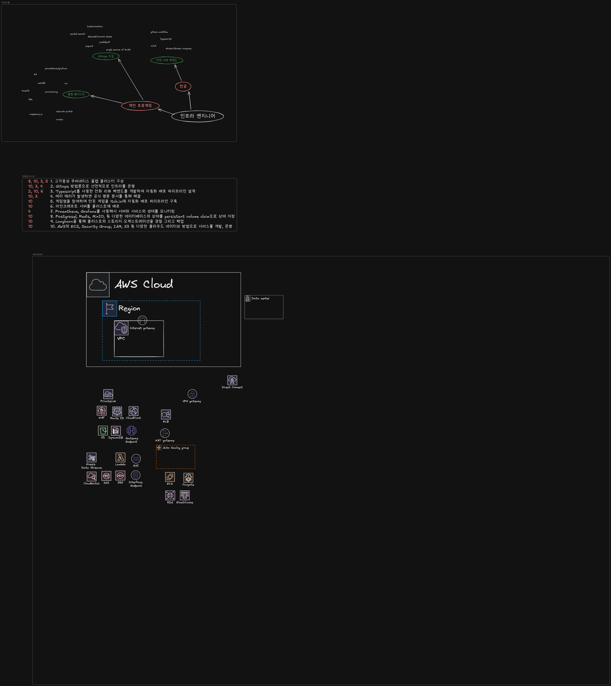

# 인프라 데모

## 네트워킹 및 콘텐츠 전송

VPC

Route53

ACM

ALB

IGW

NGW

Cloudfront

VPC Endpoint

## 컴퓨팅

ASG

Fargate

Lambda

## 데이터베이스 및 스토리지

S3

RDS

Redis

Backup

## 메시징

SNS

SQS

## 데이터 엔지니어링 및 머신러닝

Kinesis Data Streams

Kinesis Firehose

Glue

Athena

SageMaker

## 보안 및 관제

IAM

KMS

Secrets Manager

CloudWatch

X-Ray

CloudTrail

WAF

Shield
